# **Zephron Protocol**

> _Zephron Protocol is a unified ecosystem that transforms physical gold into a liquid on-chain asset, enabling users to instantly borrow against their holdings._

**MVP Demo Video:** [https://drive.google.com/file/d/1-kgw9fPsz_Z3dJifnMFgQtC7-HQZnNvD/view](https://drive.google.com/file/d/1-kgw9fPsz_Z3dJifnMFgQtC7-HQZnNvD/view)

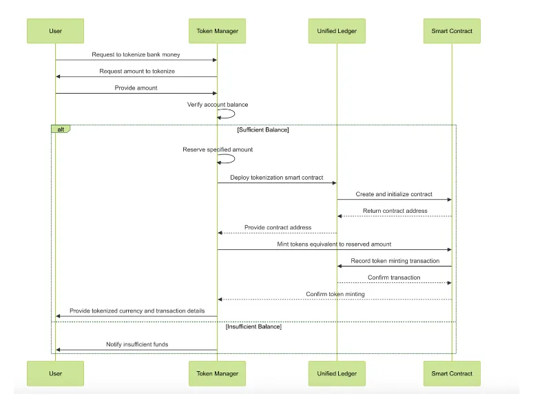

## Table of Contents

- [The Problem](#the-problem)
- [Our Solution](#our-solution-a-unified-ecosystem-and-protocol-for-programmable-gold)
- [Product Deep Dive 1: Programmable Gold Protocol](#product-deep-dive-1-with-mvp-the-programmable-gold-on-chain-protocol)
  - [Core Mechanics & User Flows](#core-mechanics--user-flows)
  - [Mathematical Formulas](#mathematical-formulas)
- [Product Deep Dive 2: Digital Portfolio Platform](#product-deep-dive-2-the-digital-portfolio-platform)
  - [Core Mechanics & User Flows](#core-mechanics--user-flows-1)
  - [Mathematical Formulas](#mathematical-formulas-1)
- [Product Deep Dive 3: Lending Protocol](#product-deep-dive-3-the-lending-protocol)
  - [Core Mechanics & User Flows](#core-mechanics--user-flows-2)
  - [Mathematical Formulas](#mathematical-formulas-2)
  - [Dynamic Interest Model](#dynamic-interest-model)
- [Devnet Deployments](#devnet-deployments)
- [Repository Structure](#repository-structure)
- [Getting Started](#getting-started)
  - [Prerequisites](#prerequisites)
  - [Clone & Install](#clone--install)
  - [Run the Frontend](#run-the-frontend)
  - [Build & Test the Program](#build--test-the-program)
  - [Deploy to Devnet](#deploy-to-devnet)
- [Roadmap](#roadmap)
- [Contributing](#contributing)
- [Security](#security)
- [License](#license)
- [Acknowledgements](#acknowledgements)

# **The Problem**

For millions of households, physical gold remains the primary store of wealth yet it is illiquid and unproductive. There is no instant financial infrastructure or liquidity base layer to unlock this static capital, connect USD and non-USD markets, or support the use of local stablecoins in everyday commerce. Existing tokenized gold products like XAUt only offer limited trading pairs and opaque custody, failing to provide true liquidity or seamless integration. The result is a borderless economy that remains out of reach, with trillions in real-world value trapped in slow, costly financial channels.

The current market is bifurcated, forcing households into a difficult trade-off.

**The Physical Market:** Owning physical gold provides true ownership but is plagued by **high custodial costs, poor liquidity, slow T+2 settlement times, and a lack of utility.**

# **Our Solution: A Unified Ecosystem and Protocol for Programmable Gold**

_The figure presents the final product with the integration of programmable gold._

We are building a vertically integrated, two-pronged solution that solves the core problems of trust, liquidity, and utility.

- **The Digital Portfolio Platform:** This is an intuitive gateway for users to seamlessly convert fiat currency (INR/USD/NPR) into tokenized gold. It provides banking-style features, including asset management, deposits, and collateralized lending, making digital gold accessible and useful.

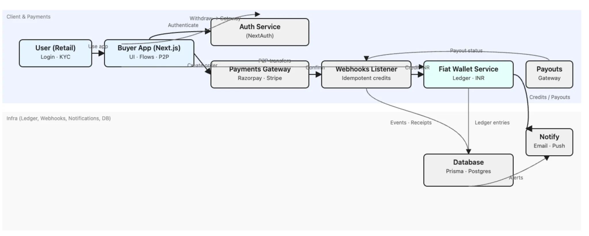

- **The Programmable Gold Protocol:** This is the on-chain layer where gold's value is made programmable and liquid. By collateralizing assets within this transparent protocol, users can mint a stable, GOLD-pegged digital asset, unlocking liquidity and enabling participation in the broader digital economy without selling their underlying holdings.

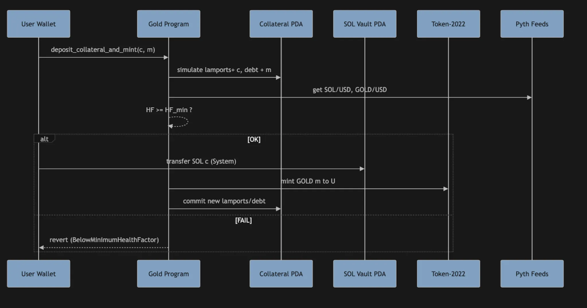

- **Unlocking Liquidity & Yield (Lending):** The core utility of our ecosystem is the ability to unlock the value of your assets without selling them. Users can lock their tokenized gold as collateral to take out instant loans, providing immediate liquidity. This creates a powerful engine for both borrowing and yield generation. All lending is governed by a strict, real-time mathematical model to ensure system solvency at all times.

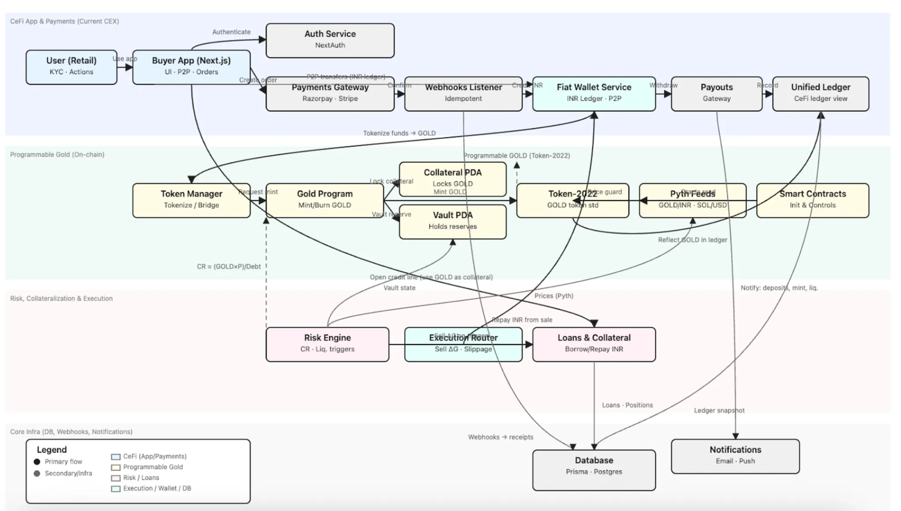

## Product Deep Dive 1 with MVP: The Programmable Gold On-Chain Protocol

It allows users to lock SOL as an Asset as collateral to mint a synthetic, GOLD-pegged stable asset. This creates a capital-efficient way to access liquidity against crypto holdings, with risk managed transparently by on-chain smart contracts.

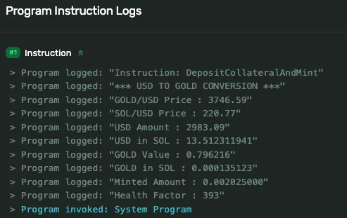

**Program Id:** `EGtHEv1xJP3aA3fT5JVB7H2UXoR6s7rB6iYjkifDqdvQ`

**Signature:** `7ruA1gESbkMz1tvoKNFmADHg3XtvptwwXLSk2JxKt3TmGtvUdaF2jXR4gkbJovokQSgQ8Qw85LTJDSSctef11rn`

**Initialization:** [https://explorer.solana.com/tx/5nQmjPPLXavsWMMmTauj6Lo23QkC9pRG1WUK8HpAdBWdyJQnUQHtm4w1VCKwY2vUhXwQWLtMF5wyqasFT4EKBXQ5?cluster=devnet](https://explorer.solana.com/tx/5nQmjPPLXavsWMMmTauj6Lo23QkC9pRG1WUK8HpAdBWdyJQnUQHtm4w1VCKwY2vUhXwQWLtMF5wyqasFT4EKBXQ5?cluster=devnet)

### **Core Mechanics & User Flows**

1. **Deposit & Mint:** A user deposits an SOL asset into their personal, on-chain collateral vault (PDA). They can then mint a specified amount of the GOLD token against this collateral, provided their position remains safely over-collateralized.
2. **Redeem & Burn:** The user can repay their minted GOLD debt at any time. By burning GOLD tokens, they unlock and withdraw a corresponding amount of their SOL collateral.
3. **Liquidation:** If the value of the user's SOL collateral drops, their position's Health Factor decreases. If it falls below a minimum threshold, the position becomes eligible for liquidation. Any third-party user (a "liquidator") can repay a portion of the user's GOLD debt in exchange for receiving a discounted amount of their SOL collateral, thus securing the protocol.

**Key Variables:**

- L: Lamports of SOL in the user's collateral vault (1 SOL=10^9 lamports).
- Dgold: Amount of GOLD minted by the user (debt), with 9 decimals.
- Psol_usd: Price of SOL in USD from the Pyth oracle.
- Pgold_usd: Price of GOLD in USD from the Pyth oracle.
- HF: Health Factor, a dimensionless ratio of collateral value to debt value.
- HFmin: The minimum Health Factor before liquidation is triggered (e.g., 1.0).
- Bonus%: The liquidation bonus percentage paid to liquidators (e.g., 10%).

### **1. Collateral and Debt Valuation**

- **Value of SOL Collateral in USD (scaled to 10^9 precision):**

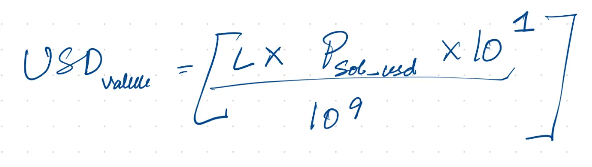

- **Value of Collateral in GOLD Terms (scaled to 10^9 precision):** This formula converts the USD value of the collateral into its equivalent value in GOLD.

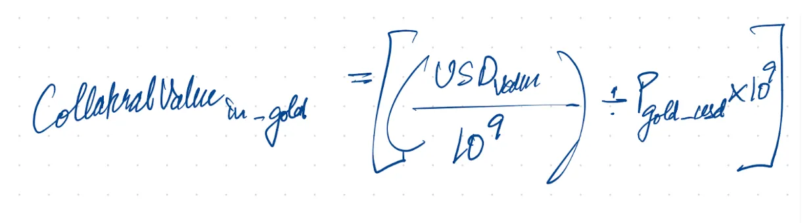

### **2. Health Factor and Liquidation**

- **Health Factor (HF) Calculation:** This is the most critical risk metric. It measures how many times the collateral value covers the debt.

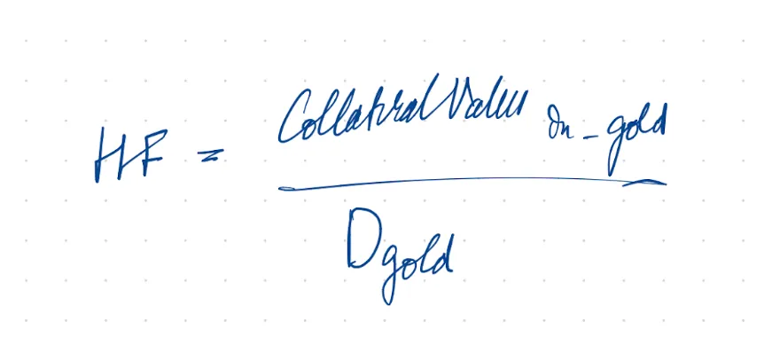

- **Liquidation Condition:** A position is deemed unsafe and open to liquidation when:

`HF < HFmin`

- **Maximum Mintable GOLD:** The maximum amount of GOLD a user can mint against their collateral L without being instantly liquidatable.

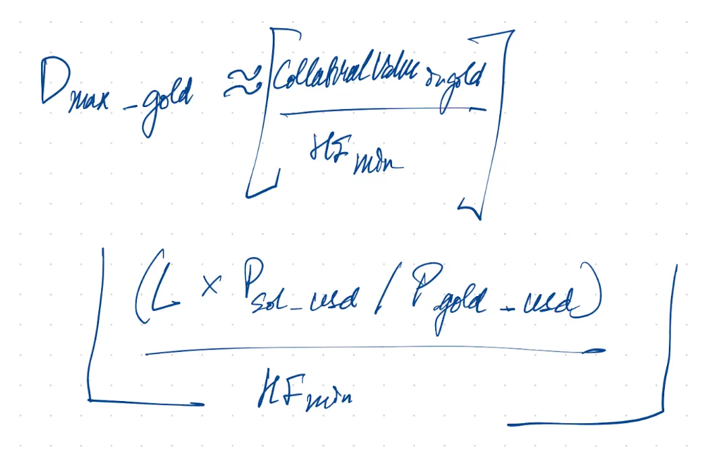

### **3. Liquidation Payout Calculation**

- **SOL Equivalent for Burned GOLD:** When a liquidator burns an amount of GOLD (Dburn), this formula calculates the base amount of SOL they are entitled to from the borrower's vault.

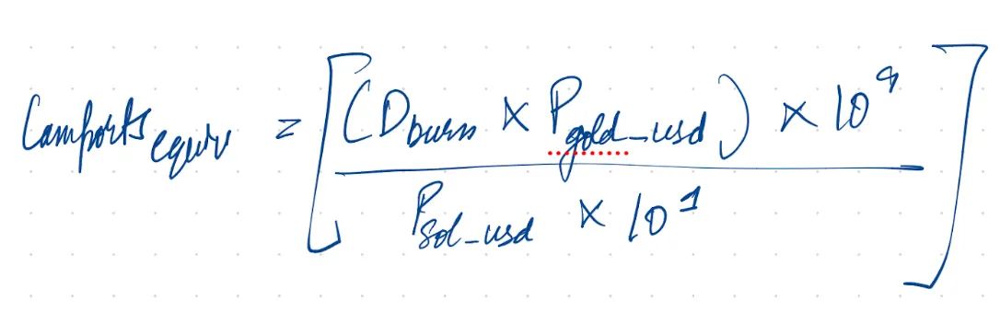

- **Total Liquidation Payout (with bonus):** The liquidator receives the base SOL amount plus a bonus to incentivize them to secure the protocol.

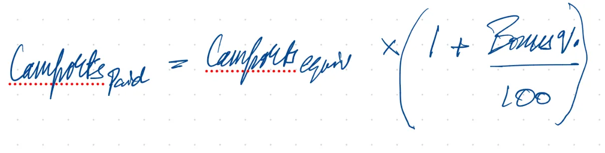

## **Product Deep Dive 2: The Digital Portfolio Platform**

This platform serves as the intuitive, regulated front-end to our ecosystem. It handles user onboarding (KYC/AML), fiat-to-crypto conversion, and provides a familiar interface for managing a portfolio of digital assets, including physically-backed tokenized gold. Its key feature is offering instant liquidity through gold-collateralized INR loans.

### **Core Mechanics & User Flows**

1. **Onboarding & Deposit:** Users complete a standard KYC process. They can then deposit INR instantly via integrated payment gateways like Razorpay and Stripe.
2. **Buy & Hold Gold:** Users convert their INR balance into tokenized gold grams at real-time market prices. This gold is fully backed by SOL and Stablecoin as collateral.
3. **Collateralize & Borrow:** Users can lock their gold holdings as collateral to open an instant line of credit, borrowing INR against their assets without selling them.
4. **Monitor & Repay:** The platform provides a real-time dashboard to monitor the health of their loan (Collateralization Ratio). Users can repay the loan principal and accrued interest at any time to unlock their gold.
5. **Liquidation:** If the market price of gold falls and the loan's Collateralization Ratio breaches a minimum threshold, the platform's risk engine automatically sells just enough of the collateralized gold to bring the loan back to a healthy state.

**Key Variables:**

- G: Grams of gold held as collateral.
- Pt: Market price of gold per gram at time t.
- h: Collateral haircut (a safety buffer, e.g., 5% or 0.05).
- L: Loan principal in INR.
- CR: Collateralization Ratio.
- LTV: Loan-to-Value ratio.
- CRtarget: The ideal ratio at the initiation of a loan (e.g., 2.0 or 200%).
- CRmin: The minimum ratio that triggers a liquidation event (e.g., 1.5 or 150%).
- λ: Liquidation penalty applied to the collateral sold (e.g., 8% or 0.08).
- R(annual): The annual percentage rate (APR) for the loan.

### **1. Loan and Value Calculations**

- **Effective Collateral Value (Vc):** The value of the collateral after applying the safety haircut.

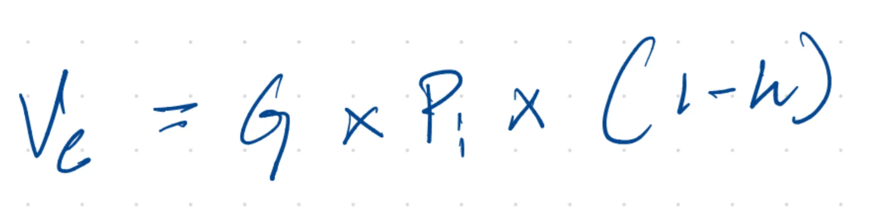

- **Collateralization Ratio (CR) and Loan-to-Value (LTV):** CR measures collateral safety, while LTV is its inverse.

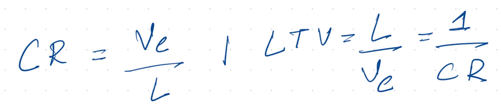

- **Maximum Borrowing Capacity (Lmax):** The maximum INR a user can borrow against their gold, based on the target CR.

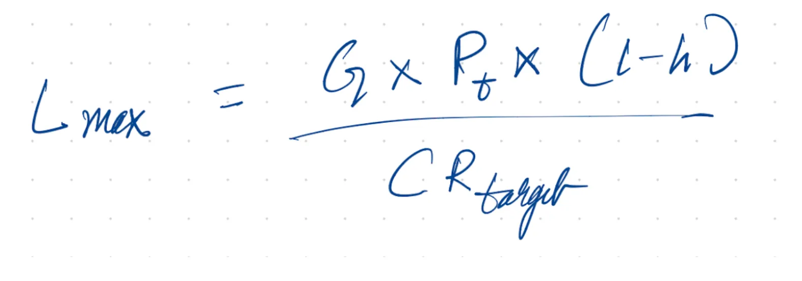

### **2. Interest and Liquidation**

- **Interest Accrual (Compounding Daily):** The outstanding loan balance grows over time based on the interest rate.

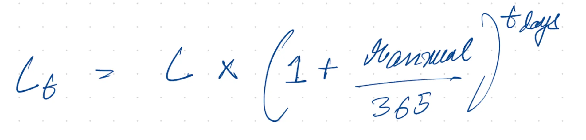

- **Liquidation Trigger Price (Pliq):** The critical gold price at which the Collateralization Ratio hits the minimum threshold and a liquidation is triggered.

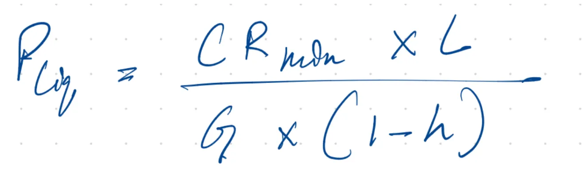

- **Partial Liquidation Sizing (ΔG):** This formula calculates the precise amount of gold (ΔG) that must be sold to restore the loan's health to the target CR.

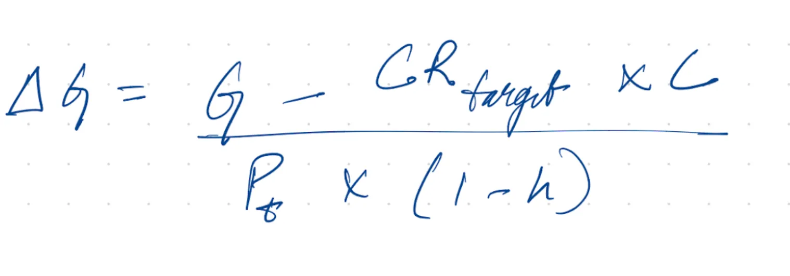

## **Product Deep Dive 3: The Lending Protocol**

This is a decentralized lending and borrowing protocol built on Solana that enables users to deposit GOLD as collateral and borrow SOL/USDC against them. It implements a shares-based accounting system for fair distribution of interest and provides automated liquidation mechanisms to protect protocol solvency. The protocol uses Pyth oracles for real-time price feeds.

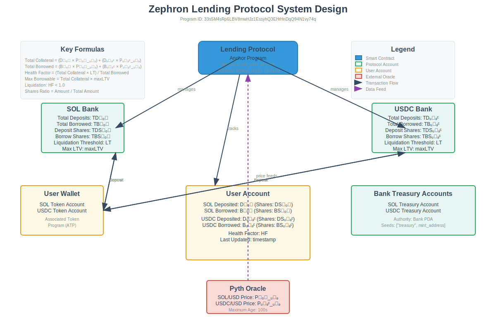

**Program Id:** `33s5M4sRp6LBV8mwHJz1EssyhQ3EHrHnDqQ94N1vy74q`

### **Core Mechanics & User Flows**

1. **Initialize Bank & User:** The protocol administrator initializes a Bank for each supported asset (SOL, USDC) with parameters like liquidation threshold and max LTV. Users create their User account to track their positions across all assets.

2. **Deposit Collateral:** Users deposit tokens into the protocol's bank vault. Deposits are tracked using a shares-based system, where users receive deposit shares proportional to their contribution.

3. **Borrow Assets:** Users can borrow assets up to their maximum borrowing capacity, determined by their total collateral value and the bank's max LTV parameter. Borrowed positions are also tracked using shares to handle interest accrual fairly across all borrowers.

4. **Repay Borrowed Assets:** Users repay their borrowed amounts plus accrued interest. Repayments reduce their borrow shares and improve their health factor, unlocking more collateral(GOLD).

5. **Withdraw Collateral:** Users can withdraw deposited collateral(GOLD) as long as their position remains sufficiently collateralized above the liquidation threshold.

6. **Liquidation:** When a user's health factor falls below 1.0 (indicating under-collateralization), liquidators can step in to repay a portion of the user's debt in exchange for their collateral plus a liquidation bonus. This protects the protocol from bad debt.

**Key Variables:**

- Dsol: Amount of SOL deposited by user (in lamports).
- Dusdc: Amount of USDC deposited by user.
- Bsol: Amount of SOL borrowed by user.
- Busdc: Amount of USDC borrowed by user.
- Psol_usd: Price of SOL in USD from Pyth oracle.
- Pusdc_usd: Price of USDC in USD from Pyth oracle.
- LT: Liquidation Threshold (e.g., 0.8 or 80%).
- maxLTV: Maximum Loan-to-Value ratio (e.g., 0.75 or 75%).
- LB: Liquidation Bonus percentage (e.g., 0.05 or 5%).
- LCF: Liquidation Close Factor (e.g., 0.5 or 50%).
- HF: Health Factor, ratio of collateral value to borrowed value.
- TD: Total Deposits in a bank.
- TDS: Total Deposit Shares in a bank.
- TB: Total Borrowed from a bank.
- TBS: Total Borrow Shares in a bank.

### **1. Shares-Based Accounting**

The protocol uses a shares system to fairly distribute interest and fees among depositors and borrowers.

- **Deposit Shares Calculation:** When a user deposits amount `A` into a bank:

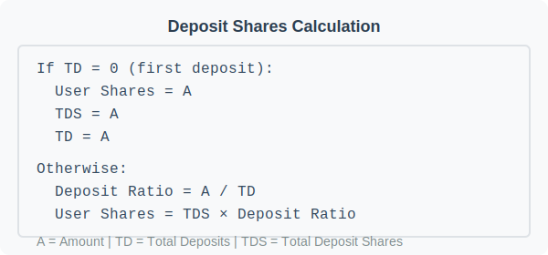

- **Borrow Shares Calculation:** When a user borrows amount `B`:

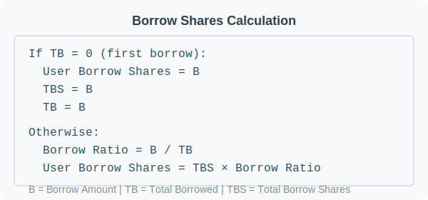

### **2. Collateral and Borrowing Calculations**

- **Total Collateral Value in USD:**

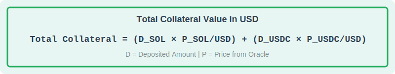

- **Total Borrowed Value in USD:**

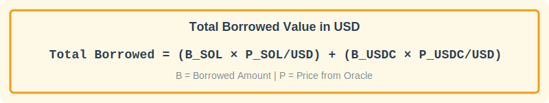

- **Maximum Borrowable Amount:** The maximum amount a user can borrow based on their collateral:

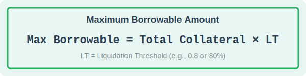

- **Borrowing Condition:** A user can borrow amount `B` only if:

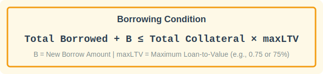

### **3. Health Factor and Liquidation**

- **Health Factor (HF) Calculation:** The critical metric determining position safety:

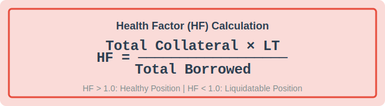

- **Liquidation Condition:** A position becomes liquidatable when:

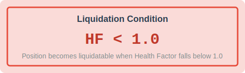

- **Liquidation Amount:** When liquidating, the liquidator repays:

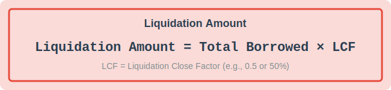

- **Liquidation Payout:** The liquidator receives collateral worth:

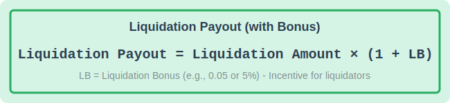

This incentivizes third-party liquidators to monitor and liquidate unhealthy positions, protecting the protocol from insolvency.

### **4. Interest Accrual (Simplified Implementation)**

The protocol includes basic interest accrual for deposits using exponential compounding:

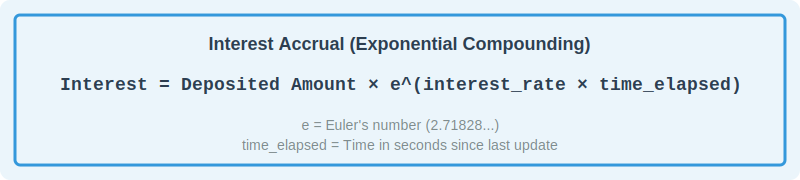

### **Dynamic Interest Model**

The lending protocol now includes a utilization-based dynamic interest model with lazy accrual on each user interaction. Borrow APR adapts to market demand using a kinked (two-slope) function.

**Parameters (per Bank):**

- `base_rate_bps`: Base APR at 0% utilization.
- `slope1_bps`: Additional APR up to the optimal utilization.
- `slope2_bps`: Additional APR beyond the optimal utilization (steeper).
- `optimal_utilization_bps`: Kink point in basis points (e.g., 8000 = 80%).

**Utilization:**

<!-- \[ u = \frac{TB}{TD} \in [0, 1] \] -->

<!-- **Borrow APR (in bps):**

\[ APR(u) = \begin{cases}
\text{base*rate_bps} + \text{slope1_bps} \cdot \frac{u}{u^*}, & u \le u^_ \\
\text{base_rate_bps} + \text{slope1_bps} + \text{slope2_bps} \cdot \frac{u - u^_}{1 - u^\_}, & u > u^\*
\end{cases} \]

where \( u^\* = \frac{\text{optimal_utilization_bps}}{10{,}000} \).

**Accrual (per second):**

\[ \Delta TB = TB \cdot \frac{APR(u)}{10{,}000} \cdot \frac{\Delta t}{\text{SECONDS_PER_YEAR}} \] -->

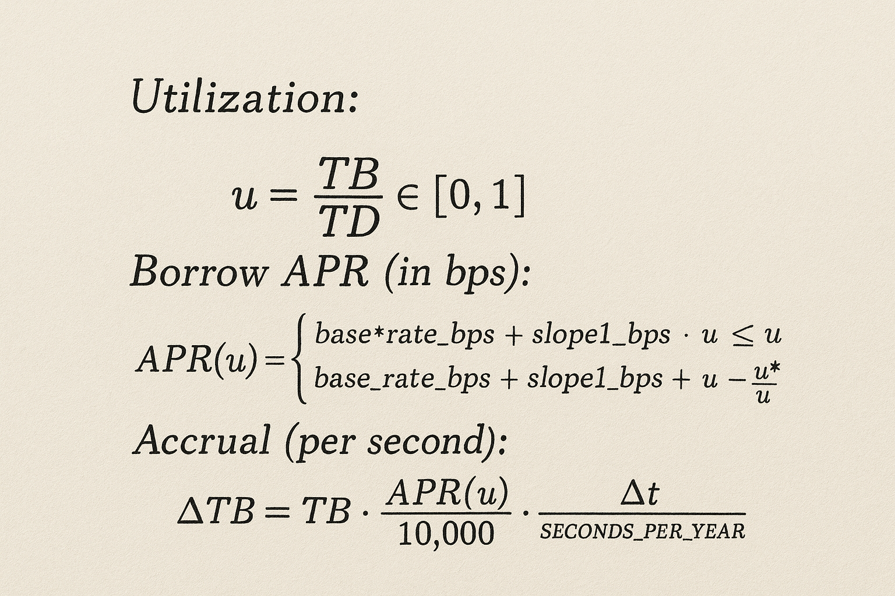

Accrual is applied lazily at the start of `deposit`, `withdraw`, `borrow`, `repay`, and `liquidate`. Shares remain constant; value per share increases as interest accrues.

**Defaults:** `base_rate_bps=200`, `slope1_bps=800`, `slope2_bps=2000`, `optimal_utilization_bps=8000`.

## Devnet Deployments

- **Program ID**: `EGtHEv1xJP3aA3fT5JVB7H2UXoR6s7rB6iYjkifDqdvQ`
- **Key Transactions**:
  - Initialize: `https://explorer.solana.com/tx/5nQmjPPLXavsWMMmTauj6Lo23QkC9pRG1WUK8HpAdBWdyJQnUQHtm4w1VCKwY2vUhXwQWLtMF5wyqasFT4EKBXQ5?cluster=devnet`
  - Deposit & Mint: `https://explorer.solana.com/tx/5DGJHuLAW1fq85Pgp9eA9cJiW1E75dUpoxqLZHMvpL2Y2rFqZU92y1YpqJHDiHLegu2dk1PFuRNs2FM5px9YvXFh?cluster=devnet`
  - Redeem & Burn: `https://explorer.solana.com/tx/4PGQosQtyKnyXhh4MBoAoW3aLuQnAjk8BREk1P5QEYvfTeRk8yykVB5w4y6cS4aDGxajGJxw3J87pwAnwZiPHg9v?cluster=devnet`
  - Update Config: `https://explorer.solana.com/tx/4ggxS1Ktsim19wxw76LbVADA9huHUs3TN8SQaYSZMBLxDinRCZQ7LDchWc5kwH5P9e7qnoCZeqDnP376xAGhtpHs?cluster=devnet`
  - Liquidate: `https://explorer.solana.com/tx/224iqrkKs8aaQ5PZrax6MsFthH5Sxt3WzXJPpKfYYkYRrqkM6JaDj85wnc2odaQgcdnUXwTDXgNptB6tffXKQmbg?cluster=devnet`
- **Pyth Oracles**:
  - GOLD/USD PriceUpdateV2: `https://explorer.solana.com/address/2uPQGpm8X4ZkxMHxrAW1QuhXcse1AHEgPih6Xp9NuEWW?cluster=devnet`
  - SOL/USD PriceUpdateV2: `https://explorer.solana.com/address/7UVimffxr9ow1uXYxsr4LHAcV58mLzhmwaeKvJ1pjLiE?cluster=devnet`

## Repository Structure

```
/Frontend
  apps/
    buyer/             # Next.js app (user portfolio & flows)
  packages/
    central/           # Shared atoms/hooks
    db/                # Prisma client & migrations
    ui/                # UI library components
/program
  programs/gold/       # Anchor program for GOLD protocol
  tests/               # Anchor mocha tests
  target/idl/          # IDL output
/lending
  programs/lending/    # Anchor program for lending protocol
  tests/               # Test suite (bankrun & onchain)
  target/idl/          # IDL output
```

## Getting Started

### Prerequisites

- Node.js 18+
- npm or pnpm
- Rust toolchain (stable)
- Solana CLI (`solana --version`)
- Anchor CLI (`anchor --version`)

### Clone & Install

```bash
# Clone
git clone https://github.com/zephron-labs/zephron-protocol.git

# Install (root)
npm install

# Install workspace deps if needed
cd Frontend/apps/buyer && npm install
```

```bash
solana config set --url https://api.devnet.solana.com
solana airdrop 2 # on devnet
```

### Run the Frontend

```bash
cd Frontend/apps/buyer
npm run dev
# App: http://localhost:3000
```

### Build & Test the Program

```bash
# For the GOLD protocol
cd program
npm install
anchor build
npm test

# For the Lending protocol
cd lending
npm install
anchor build
npm test
```

### Deploy to Devnet

```bash
# For the GOLD protocol
cd program
anchor deploy
# Verify IDL at target/idl/gold.json

# For the Lending protocol
cd lending
anchor deploy
# Verify IDL at target/idl/lending_protocol.json
```

## Roadmap

- Expand collateral types beyond SOL
- Oracle redundancy and failover
- Governance and parameter management
- Integrate automated keepers for liquidations
- Mobile-first portfolio app

## Contributing

Contributions are welcome! Please:

- Open an issue to discuss substantial changes
- Submit focused PRs with clear descriptions
- Follow existing code style and linting

## Security

- Do not use in production without a formal audit
- Report vulnerabilities privately via issues marked as security or contact maintainers
- Protocol depends on oracle integrity (Pyth) and proper risk parameters

## License

MIT — see [LICENSE](./LICENSE).

## Acknowledgements

- Pyth Network for reliable on-chain price feeds
- Solana and Anchor contributors
- The broader open-source community
